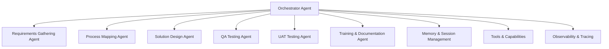

# ERP Consultant AI Agent

ERP Consultant AI is a multi-agent AI system built to support ERP Functional Consultants across the project lifecycle, from requirements gathering and process mapping through solution design, testing, and user training.

The project combines specialized AI agents with an orchestrator, project sessions, ERP knowledge resources, document generation, and a web interface for interacting with the system.

## Live Application

Try the deployed application:

https://erpconsultant-ai.onrender.com/

The application provides a web-based interface where users interact with the ERP Consultant AI agent, create projects, continue project sessions, execute consulting workflow phases, and access generated deliverables.

## Target Users

ERP Functional Consultants working on implementations and transformation projects involving platforms such as:

* SAP S/4HANA
* Oracle ERP
* Microsoft Dynamics 365
* NetSuite
* Other enterprise ERP platforms

## Why a Multi-Agent Architecture?

ERP consulting involves several distinct activities. Requirements gathering, process mapping, solution design, testing, and training require different types of analysis and produce different deliverables.

ERP Consultant AI assigns these responsibilities to specialized agents while a central orchestrator coordinates the overall workflow and maintains project context across phases.

---

## Problem Statement

ERP Functional Consultants spend significant time on repetitive documentation, requirement gathering, testing preparation, and training material creation.

Common challenges include:

* Time-intensive documentation for requirements, solution designs, test cases, and training materials
* Inconsistent structure and quality across project deliverables
* Frequent context switching between different consulting activities
* Difficulty retaining project decisions and reusable consulting knowledge
* Manual effort involved in preparing testing and training materials

These activities reduce the time consultants have available for analysis, stakeholder engagement, and higher-value advisory work.

---

## Solution

ERP Consultant AI provides a multi-agent consulting system designed to support key ERP project activities.

Core capabilities include:

* Requirement gathering and documentation
* Business process mapping
* Solution design documentation
* QA test case generation
* UAT scenario generation
* Training material and user manual generation
* ERP-related question answering and research
* Project session management
* Generated document management

### Expected Impact

The project is designed to help consultants:

* Reduce repetitive documentation work
* Standardize consulting deliverables
* Accelerate project preparation
* Improve testing coverage
* Maintain project context across consulting phases
* Spend more time on analysis and stakeholder engagement

Any time-saving figures associated with the project are indicative estimates and have not been independently benchmarked.

---

## Architecture

The system uses a central orchestrator with specialized agents responsible for individual consulting activities.



### Agent Responsibilities

| Agent                          | Responsibility                                                                                     |
| ------------------------------ | -------------------------------------------------------------------------------------------------- |
| Orchestrator Agent             | Coordinates workflow phases, routes tasks, manages execution, and maintains project state          |
| Requirements Gathering Agent   | Captures stakeholder input and produces structured requirements                                    |
| Process Mapping Agent          | Maps business processes and identifies current-state, future-state, and integration considerations |
| Solution Design Agent          | Produces solution design documentation covering configurations, integrations, and design decisions |
| QA Testing Agent               | Generates QA test cases based on requirements and solution design                                  |
| UAT Testing Agent              | Creates business-focused UAT scenarios aligned with requirements and user workflows                |
| Training & Documentation Agent | Produces training materials, user guides, and process documentation                                |

### Supporting Components

| Component                   | Role                                                                                                            |
| --------------------------- | --------------------------------------------------------------------------------------------------------------- |
| Memory & Session Management | Maintains project sessions, context, and reusable knowledge                                                     |
| Tools & Capabilities        | Provides ERP knowledge retrieval, web research, document generation, process visualization, and test generation |
| Observability               | Provides structured logging, tracing, and performance monitoring                                                |
| API Layer                   | Provides authentication, project management, chat, feedback, health, and document endpoints                     |
| Web Interface               | Provides the user-facing interface for interacting with the ERP Consultant AI system                            |

---

## Technical Stack

| Technology                           | Role                                              |
| ------------------------------------ | ------------------------------------------------- |
| Python 3.10+                         | Application, agents, tools, and orchestration     |
| FastAPI                              | Web API and application server                    |
| Google Gemini API                    | Primary LLM for reasoning and structured output   |
| SQLAlchemy                           | Database access and persistence                   |
| PostgreSQL                           | Persistent application data                       |
| Pydantic                             | Structured data validation and LLM output schemas |
| InMemorySessionService + Memory Bank | Project sessions and consulting context           |
| SerpAPI                              | Web research and external information retrieval   |
| Structlog                            | Structured application logging                    |
| Pytest                               | Unit, integration, and evaluation testing         |
| HTML, CSS, JavaScript                | User-facing web interface                         |
| Render                               | Application hosting and deployment                |

---

## Features

### Multi-Agent Orchestration

* Central orchestrator for ERP consulting workflows
* Specialized agents for each consulting phase
* Sequential workflow execution
* Project state maintained across phases
* Structured outputs for downstream processing

### ERP Consulting Capabilities

* Requirements gathering
* Business process mapping
* Solution design
* QA testing
* UAT testing
* Training material generation
* ERP knowledge retrieval
* Web research

### Project Management

* User accounts
* Project creation
* Project sessions
* Project status tracking
* Phase progress tracking
* Project archiving
* Generated document management
* User feedback

### Memory & Context

* Session-based project continuity
* Project-specific context
* Long-term memory for reusable knowledge
* Context management for large consulting workflows

### Web Application

The deployed application provides a browser-based interface for interacting with the agent.

Live application:

https://erpconsultant-ai.onrender.com/

The interface is served directly by the FastAPI application and communicates with the application's API endpoints.

### Observability

* Structured application logging
* Request correlation IDs
* Error handling and standardized API responses
* Health and readiness endpoints
* Agent execution tracing
* Performance monitoring

---

## Quick Start

### 1. Clone the Repository

```bash
git clone https://github.com/James-Muguro/erp-consultant-agent.git

cd erp-consultant-agent
```

### 2. Create the Python Environment

```bash
python -m venv .venv
```

Activate it on Linux/macOS:

```bash
source .venv/bin/activate
```

Activate it on Windows:

```bash
.venv\Scripts\activate
```

Install dependencies:

```bash
pip install -r requirements.txt
```

### 3. Configure Environment Variables

Copy the environment template:

```bash
cp .env.example .env
```

Configure the required environment variables in `.env`.

Example:

```env
GEMINI_API_KEY="your_gemini_api_key"
SERPAPI_API_KEY="your_serpapi_api_key"
API_AUTH_KEY="your_generated_secret"
```

Generate a strong secret:

```bash
python -c "import secrets; print(secrets.token_urlsafe(32))"
```

### 4. Run the Application

Run the CLI:

```bash
python src/main.py
```

Run the web application:

```bash
python -m src.orchestrator_api
```

The web application will be available locally at:

```text
http://127.0.0.1:8000
```

---

## Usage Examples

### Example 1: Start a Project and Gather Requirements

```python
from src.agents.requirements_agent import requirements_agent
from src.memory import agent_memory

session_id = agent_memory.create_project(
    project_name="SAP S/4HANA Implementation",
    module="FI"
)

result = requirements_agent.gather_requirements(
    session_id=session_id,
    project_name="SAP S/4HANA Implementation",
    module="Finance - Accounts Payable",
    stakeholder_input="We need automated three-way matching between purchase orders, goods receipts, and vendor invoices.",
    erp_system="SAP S/4HANA"
)
```

### Example 2: Generate QA Test Cases

```python
from src.agents.testing_agents import qa_testing_agent

result = qa_testing_agent.generate_test_cases(
    session_id=session_id,
    solution_design={
        "configurations": [],
        "integrations": []
    },
    module="MM",
    scope="comprehensive"
)
```

### Example 3: Start a Project Through the Orchestrator

```python
from src.orchestrator import orchestrator

result = orchestrator.start_project(
    project_name="SAP S/4HANA Implementation",
    module="FI",
    erp_system="SAP S/4HANA"
)
```

---

## Testing

Run the complete test suite:

```bash
pytest
```

Run with coverage:

```bash
pytest --cov=src tests/
```

Run a specific test suite:

```bash
pytest tests/test_requirements_agent.py
```

The test suite covers:

* Individual agent behavior
* Orchestrator workflows
* Authentication
* Multi-user session isolation
* API functionality
* Structured output validation
* Evaluation metrics
* Production API behavior

---

## Evaluation

The project includes automated evaluation metrics for assessing agent output quality.

Current evaluation areas include:

* Requirements completeness
* Test case coverage
* Documentation quality
* Agent performance
* Workflow execution

The project includes a 170-point evaluation framework with a 70% pass threshold.

See:

```text
tests/evaluation_metrics.py
```

for the evaluation implementation.

---

## Project Structure

```text
erp-consultant-agent/

├── src/
│   ├── orchestrator.py
│   ├── main.py
│   ├── orchestrator_api.py
│   │
│   ├── agents/
│   │   ├── requirements_agent.py
│   │   ├── process_mapping_agent.py
│   │   ├── solution_design_agent.py
│   │   ├── testing_agents.py
│   │   └── training_agent.py
│   │
│   ├── models/
│   │   └── ...
│   │
│   ├── tools/
│   │   └── ...
│   │
│   ├── memory/
│   │   └── ...
│   │
│   ├── auth/
│   │   └── ...
│   │
│   ├── db/
│   │   └── ...
│   │
│   ├── utils/
│   │   └── ...
│   │
│   └── config/
│       └── ...
│
├── tests/
│   ├── test_requirements_agent.py
│   ├── test_orchestrator.py
│   ├── evaluation_metrics.py
│   └── run_tests.py
│
├── docs/
│   ├── architecture.md
│   ├── user_guide.md
│   └── SUBMISSION.md
│
├── ui/
│   ├── index.html
│   ├── app.js
│   └── style.css
│
├── demo.py
├── requirements.txt
└── README.md
```

---

## Engineering Design Decisions

### Multi-Agent Architecture

Specialized agents handle individual ERP consulting activities rather than placing the entire workflow inside one monolithic agent.

This separation allows each agent to focus on its specific responsibility and produce outputs suited to the next stage of the workflow.

### Structured LLM Output

Pydantic schemas provide validation for structured agent outputs.

This improves consistency and allows downstream components to process agent results programmatically.

### Session and Memory Management

Project sessions preserve context across multiple interactions and workflow phases.

The memory layer also supports reusable consulting knowledge and context management.

### API Authentication

The application includes user authentication and protected API endpoints.

Users authenticate before accessing protected project and consulting functionality. The application also uses an API authentication secret for server-level protection where configured.

### Observability

Structured logging, request IDs, health checks, readiness checks, and error handling provide visibility into application behavior and simplify troubleshooting.

---

## Deployment

The application is currently deployed using Render.

Live application:

https://erpconsultant-ai.onrender.com/

The deployed service runs the FastAPI application and serves the user interface from the same application.

Production deployment requires the appropriate environment variables and external services configured in the hosting environment.

---

## Project Highlights

* Multi-agent architecture for ERP consulting workflows
* 6 specialized consulting agents
* Structured LLM outputs using Pydantic schemas
* Requirements, process mapping, solution design, QA, UAT, and training workflows
* Web-based user interface
* User authentication
* Multi-user project isolation
* Persistent feedback
* Generated consulting documents
* Structured logging and request tracing
* Health and readiness endpoints
* Automated unit and integration testing
* 170-point evaluation framework

---

## Limitations and Current Status

### Current Limitations

* Some evaluation metrics are indicative and are not independently benchmarked
* Live API tests require valid external API credentials
* Some memory functionality remains process-dependent
* Free hosting environments have resource and cold-start limitations
* AI-generated consulting outputs require professional review before use in production ERP projects

### Status

The project is actively undergoing production hardening and frontend development.

The deployed application is available for testing at:

https://erpconsultant-ai.onrender.com/

---

## License

This project is licensed under the MIT License.

See the `LICENSE` file for the full license terms.