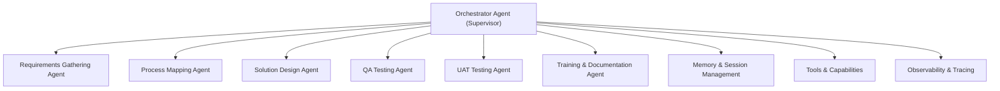

# ERP Consultant AI Agent

An intelligent multi-agent system designed to support ERP Functional Consultants throughout the entire project lifecycle — from requirement gathering to user training. The system automates repetitive documentation tasks, manual requirement gathering, and training material creation, allowing consultants to focus on high-value advisory work.

**Target users:** ERP Functional Consultants implementing systems such as SAP S/4HANA, Oracle ERP, Microsoft Dynamics, or similar platforms.

**Why multi-agent:** ERP consulting workflows involve distinct phases (requirements, process mapping, solution design, testing, training) with different expertise and output formats. A multi-agent architecture allows specialized agents to handle each phase while an orchestrator coordinates the overall workflow and maintains context across stages.

---

## Problem Statement

ERP Functional Consultants spend 60–70% of their time on repetitive documentation tasks, manual requirement gathering, and creating training materials. This reduces billable hours and delays project delivery timelines.

Specific pain points:

- **Time-intensive documentation:** Requirements, solution designs, test cases, and training manuals require significant manual effort
- **Inconsistent deliverables:** Different consultants produce varying quality and structure in documentation
- **Context switching:** Moving between requirement gathering, process mapping, testing, and training dilutes focus
- **Knowledge retention:** Best practices and project-specific decisions are not systematically captured for reuse

---

## Solution

An **ERP Consulting Multi-Agent System** that automates key consulting deliverables through specialized agents coordinated by an orchestrator:

- ✅ Requirement gathering and documentation
- ✅ Business process mapping
- ✅ Solution design documentation
- ✅ QA test case generation
- ✅ UAT testing scenarios
- ✅ Training materials and user manuals

**Expected Impact:**

- ⏱️ Save 15–20 hours per week on documentation *(indicative estimate, not independently benchmarked)*
- 📊 Standardized, high-quality deliverables through structured output schemas
- 🚀 Faster project delivery cycles via parallel agent execution where applicable
- ✅ Consistent testing coverage across modules and scenarios

---

## Architecture

The system uses a multi-agent architecture with a central orchestrator coordinating specialized agents:



### Agent Responsibilities

| Agent | Responsibility |
|-------|----------------|
| **Orchestrator Agent** | Coordinates workflow phases, routes tasks to specialized agents, manages sequential and parallel execution, maintains state across workflow phases |
| **Requirements Gathering Agent** | Captures stakeholder input, documents requirements in structured format, validates completeness |
| **Process Mapping Agent** | Maps business processes, identifies integration points, documents current and future state workflows |
| **Solution Design Agent** | Produces solution design documentation, captures configurations, integrations, and customization decisions |
| **QA Testing Agent** | Generates QA test cases based on solution design, ensures coverage across configurations and integrations |
| **UAT Testing Agent** | Creates UAT testing scenarios aligned with business requirements and user workflows |
| **Training & Documentation Agent** | Produces training materials, user manuals, and process documentation for end users |

### Supporting Components

| Component | Role |
|-----------|------|
| **Memory & Session Management** | InMemorySessionService + Memory Bank for project continuity, long-term memory for best practices, context compaction for large documents |
| **Tools & Capabilities** | Google Search integration, custom ERP knowledge base, document generation, process visualization, test case generation |
| **Observability** | Structured logging, agent tracing, performance metrics for monitoring and debugging |

---

## Technical Stack

| Technology | Role in System |
|------------|----------------|
| **Google Gemini API** | AI framework powering agent reasoning and structured output generation |
| **Python 3.10+** | Implementation language for all agents, tools, and orchestration logic |
| **InMemorySessionService + Memory Bank** | Session management for project continuity, long-term memory for best practices and historical decisions |
| **Structured logging and tracing** | Observability layer for agent tracing, performance monitoring, and debugging |
| **pytest with evaluation metrics** | Unit and integration testing, automated evaluation of agent outputs |

---

## Features

### Multi-Agent Orchestration

- Orchestrator with intelligent task routing to specialized agents
- Sequential and parallel agent execution based on workflow phase
- State management across workflow phases to maintain context

### Tools & Capabilities

- Google Search integration for external research
- Custom ERP knowledge base for domain-specific queries
- Document generation for requirements, designs, and training materials
- Process visualization for workflow documentation
- Test case generation for QA and UAT scenarios

### Memory & Context Management

- Session management for project continuity across multiple interactions
- Long-term memory bank for storing best practices and reusable patterns
- Context compaction for handling large documents without losing key information

### Observability

- Structured logging for all agent actions and decisions
- Agent tracing for debugging and performance analysis
- Performance metrics for monitoring workflow execution times and quality

---

## Quick Start

### 1. Clone Repository

```bash
git clone https://github.com/James-Muguro/erp-consultant-agent.git
cd erp-consultant-agent
```

### 2. Set Up Environment

```bash
# Create virtual environment
python -m venv .venv

# Activate (Linux/macOS)
source .venv/bin/activate

# Activate (Windows)
.venv\Scripts\activate

# Install dependencies
pip install -r requirements.txt
```

### 3. Configure API Keys

```bash
# Copy environment template
cp .env.example .env
```

Edit `.env` and set these **three required values** (the app will not start without all three):

```env
GEMINI_API_KEY="your_gemini_api_key"       # https://aistudio.google.com/apikey
SERPAPI_API_KEY="your_serpapi_key"          # https://serpapi.com/
API_AUTH_KEY="a_random_secret_you_generate"
```

Generate a strong `API_AUTH_KEY` (this protects the API server, not a third-party key):

```bash
python -c "import secrets; print(secrets.token_urlsafe(32))"
```

### 4. Run the Agent

```bash
# CLI entry point
python src/main.py

# API server with demo UI
python -m src.orchestrator_api
```

---

## Usage Examples

### Example 1: Start a Project and Gather Requirements

```python
from src.agents.requirements_agent import requirements_agent
from src.memory import agent_memory

session_id = agent_memory.create_project(
    project_name="SAP S/4HANA Implementation",
    module="FI"
)

result = requirements_agent.gather_requirements(
    session_id=session_id,
    project_name="SAP S/4HANA Implementation",
    module="Finance - Accounts Payable",
    stakeholder_input="We need automated three-way matching between purchase orders, goods receipts, and vendor invoices.",
    erp_system="SAP S/4HANA"
)
```

### Example 2: Generate QA Test Cases

```python
from src.agents.testing_agents import qa_testing_agent

result = qa_testing_agent.generate_test_cases(
    session_id=session_id,
    solution_design={"configurations": [], "integrations": []},
    module="MM",
    scope="comprehensive"
)
```

### Example 3: Run the Full Workflow via the Orchestrator

```python
from src.orchestrator import orchestrator

result = orchestrator.start_project(
    project_name="SAP S/4HANA Implementation",
    module="FI",
    erp_system="SAP S/4HANA"
)
```

---

## Testing

```bash
# Run all tests
pytest

# Run with coverage
pytest --cov=src tests/

# Run specific test suite
pytest tests/test_requirements_agent.py
```

The test suite includes:

- Unit tests for individual agents
- Integration tests for orchestrator workflows
- Evaluation metrics for output quality

---

## Evaluation

The system includes automated evaluation metrics to assess output quality:

- **Requirements completeness score:** Measures coverage of key requirement categories
- **Test case coverage analysis:** Evaluates breadth and depth of generated test scenarios
- **Documentation quality metrics:** Assesses structure, clarity, and completeness
- **Agent performance benchmarks:** Tracks execution time and resource usage

**Evaluation framework:** 170-point evaluation system with a 70% pass threshold (see `tests/evaluation_metrics.py`).

---

## Project Structure

```text
erp-consultant-agent/
├── src/
│   ├── orchestrator.py              # Main workflow coordinator
│   ├── main.py                      # CLI interface
│   ├── orchestrator_api.py          # API server with demo UI
│   ├── agents/                      # 6 specialized agents
│   │   ├── requirements_agent.py
│   │   ├── process_mapping_agent.py
│   │   ├── solution_design_agent.py
│   │   ├── testing_agents.py        # QA and UAT agents
│   │   └── training_agent.py
│   ├── models/                      # Pydantic schemas for structured LLM output
│   ├── tools/                       # Custom tools (ERP KB, Doc Gen, Test Gen)
│   ├── memory/                      # Session and memory management
│   ├── utils/                       # Logging, prompts, context management
│   └── config/                      # Configuration and settings
│
├── tests/
│   ├── test_requirements_agent.py
│   ├── test_orchestrator.py
│   ├── evaluation_metrics.py
│   └── run_tests.py
│
├── docs/
│   ├── architecture.md              # Technical architecture
│   ├── user_guide.md                # User documentation
│   └── SUBMISSION.md                # Original project writeup
│
├── demo.py                          # Interactive demo
└── requirements.txt                 # Dependencies
```

---

## Engineering Design Decisions

### Multi-Agent Architecture

**Decision:** Use specialized agents for each consulting phase rather than a single monolithic agent.

**Rationale:** ERP consulting workflows involve distinct phases with different expertise requirements and output formats. Specialized agents allow focused reasoning and structured outputs tailored to each phase.

### Structured LLM Output

**Decision:** Use Pydantic schemas to enforce structured output from all agents.

**Rationale:** Structured outputs enable downstream processing, validation, and integration with other systems. Unstructured text from LLMs is difficult to parse and validate programmatically.

### Session and Memory Management

**Decision:** Implement InMemorySessionService + Memory Bank for project continuity.

**Rationale:** ERP consulting projects span multiple interactions and phases. Session management maintains context across interactions, while long-term memory captures reusable patterns and best practices.

### Observability

**Decision:** Implement structured logging, agent tracing, and performance metrics.

**Rationale:** Multi-agent systems are complex to debug without visibility into agent decisions, execution order, and performance. Observability enables debugging and optimization.

### API Authentication

**Decision:** Require `API_AUTH_KEY` for API server access.

**Rationale:** Protects the API server from unauthorized access. The key is self-generated (not a third-party service) and used to authenticate API requests.

---

## Project Highlights

- **5,000+ lines** of code across agents, tools, memory, and orchestration
- **6 specialized agents** working in orchestration, each producing schema-validated structured output
- **170-point evaluation system** with a 70% pass threshold (see `tests/evaluation_metrics.py`)
- **Estimated 46–89 second** workflow execution per phase *(indicative only, not independently benchmarked)*
- **Estimated 50–70% time savings** vs. a fully manual process *(indicative only, not measured against a real baseline)*
- Unit and integration test coverage across all 6 agents, with a gated live-API test suite
- Real API authentication, atomic session persistence, and structured-output validation

---

## Limitations and Current Status

**Limitations:**

- Estimated metrics (workflow execution time, time savings) are indicative and not independently benchmarked or measured against a real baseline
- Live-API test suite requires valid API credentials and is gated accordingly
- Memory is in-memory (not persisted across process restarts unless explicitly implemented)

**Status:** Actively maintained, undergoing incremental production hardening. See commit history for progress.

---

## License

This project is licensed under the MIT License — see the [LICENSE](LICENSE) file for details.